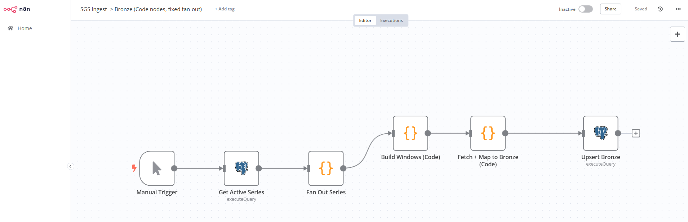
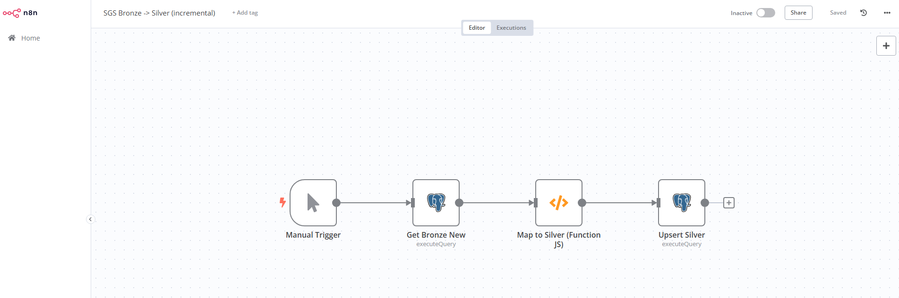
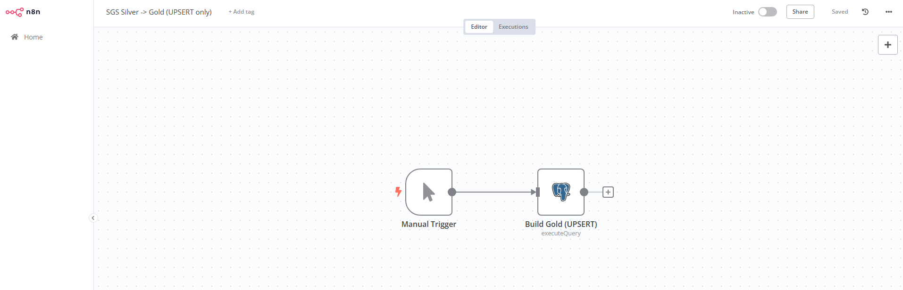
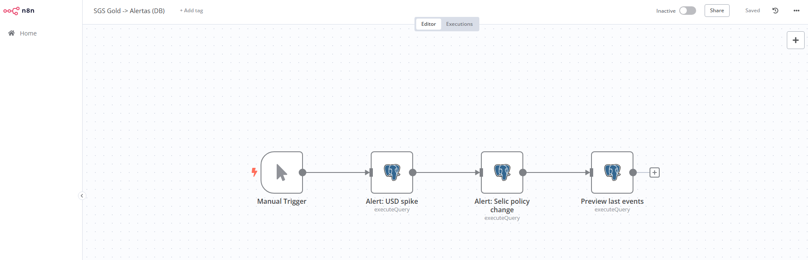
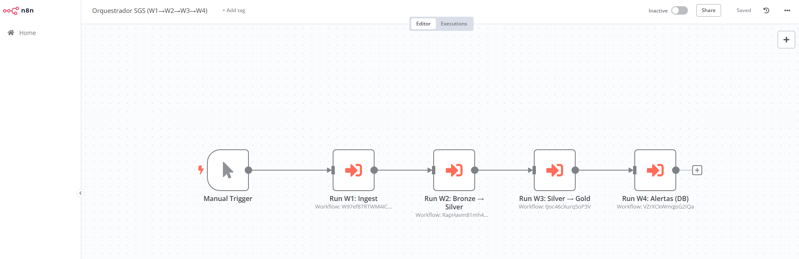

# Documentação do Projeto

Este diretório guarda imagens (prints) e anotações dos workflows n8n e do dashboard.

## Conteúdo
- **n8n/**: prints dos workflows W1–W4 e do Orquestrador
- **dashboard/**: prints do Power BI

## n8n — Workflows

### W1 — Ingest (SGS → Bronze)

### W2 — Bronze → Silver

### W3 — Silver → Gold

### W4 — Alertas (DB)

### Orquestrador

